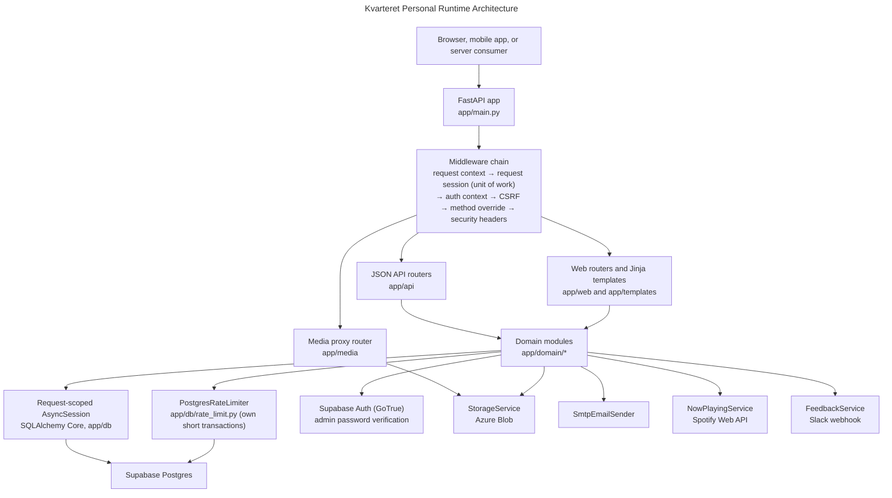
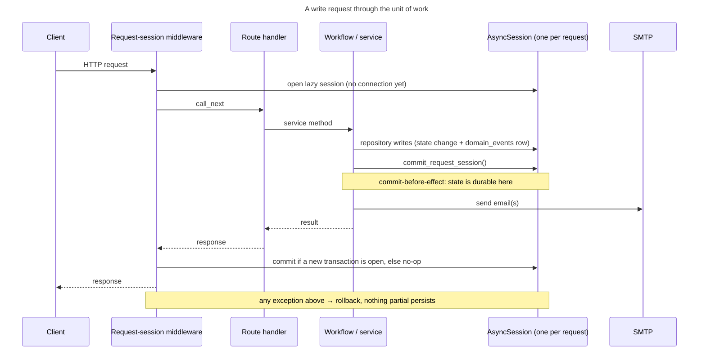
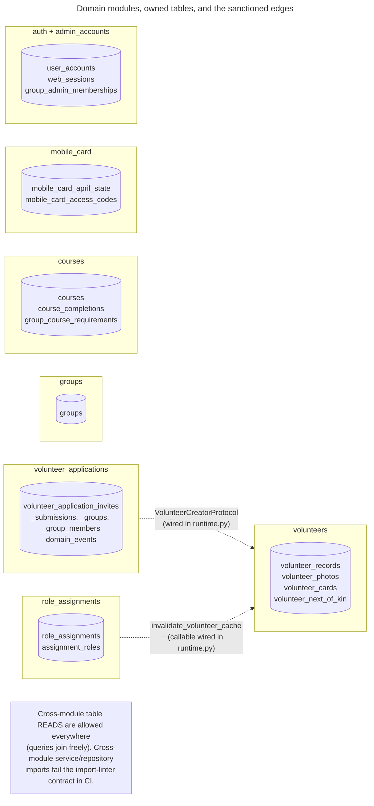

# Kvarteret Personal Architecture

`kvarteret-personal` is a FastAPI modular monolith that serves four surfaces from one runtime:

- a server-rendered admin UI using Jinja templates, HTMX, and Tailwind CSS
- JSON APIs under `/api/*`
- signed media proxy routes for private photos
- system routes such as `/health`

The app factory is `app/main.py:create_app`. `app/runtime.py` builds the application container: settings, the database engine, authentication, storage, email, the rate limiter, and every domain service wired into one object graph that tests and scripts can replace wholesale.

## Request Lifecycle: One Session, One Transaction

Every HTTP request runs inside one unit of work. The request-session middleware opens a single lazy `AsyncSession`, binds it to a `ContextVar`, and every repository the request touches shares it through `SqlAlchemyRepository.session`. The middleware commits on success and rolls back on exception. Repositories never open sessions and never commit.

Workflows that fire external side effects (email today) call `commit_request_session()` first — the commit-before-effect rule: no email may announce a state the database can still roll back. Statements executed after that explicit commit join a fresh transaction on the same session, committed at the request boundary as usual.

Two deliberate exceptions to the shared session:

- `PostgresRateLimiter` uses its own short transactions, because a throttle hit must survive even when the request that triggered it fails and rolls back.
- Scripts and non-HTTP callers wrap work in `session_scope()` from `app/db/session.py`, which provides the same ContextVar binding outside a request.

## Module Ownership and Enforced Boundaries

Each domain module owns its tables. Table definitions live in `app/domain/{module}/tables.py`, all bound to the single shared `MetaData` in `app/db/metadata.py` so Alembic autogeneration and cross-module read joins keep working. `app/db/tables.py` is the one sanctioned aggregator (used by Alembic and scripts); domain code imports tables directly from the owning module.

Two import-linter contracts run in CI and fail the build on violations:

1. **Layers** — `web`/`api` → `domain` → `db`/`infrastructure`/`shared`; nothing imports upward.
2. **Domain independence** — domain modules may not import each other's services, repositories, or workflows. The only allowed cross-module import is another module's `tables.py` (tables are the shared read seam).

Where one module genuinely needs another module's behavior, the dependency is a small protocol injected in `app/runtime.py`, never an import:

- application approval creates a volunteer through `VolunteerCreatorProtocol`, satisfied by `VolunteersService.create_from_application` — onboarding writes the same row family that `delete_volunteer` removes;
- position-management writes notify the volunteers read cache through an injected `invalidate_volunteer_cache` callable.

## Read/Write Split Inside Modules

The three largest modules separate reads from writes with the same shape, established by `groups` and now used everywhere:

- `queries.py` — a `…Queries(SqlAlchemyRepository)` class holding list/search/detail read models, caches, and cursor logic; the service class inherits it.
- `service.py` — writes, validation, orchestration; inherits the queries class.
- `repository.py` — write-side statements and the record loads the workflow needs.
- `models.py` — dataclasses, errors, protocols (where the module is big enough to warrant it).
- `volunteers` additionally keeps its search/ranking SQL in `search_sql.py`; `volunteer_applications` additionally has `state_machine.py`, `workflow.py`, and `side_effects.py` (see [the lifecycle explanation](volunteer-application-lifecycle.md) and ADR-001/ADR-003).

No file in `app/domain` exceeds the ~800-line cap.

## Route Surfaces

The public JSON API routes are composed in `app/api/router.py`:

- `/api/v1/mobile-card/*` — email access codes (stored as single-use HMAC-SHA256 hashes), signed sessions, the current card profile, session renewal via `X-Mobile-Card-Session-Token`, and logout diagnostics.
- `/api/v1/volunteer-prospects` — public recruitment intake from `samfunnetibergen`, including group signup with up to two friend invitations.
- `/api/now-playing` — the shared Spotify now-playing state.

The legacy `/api/DigitalInternkort/*` surface and the events API were removed in the 2026-06 restructure; they are intentionally absent from `openapi.json`.

The web admin routes in `app/web/router.py` cover login, volunteers, groups, courses, admin accounts, volunteer applications, feedback, and Spotify connection management. The media routes in `app/media/router.py` keep private files behind backend-signed URLs.

## Data Model Ownership

Supabase Postgres is the primary database; this repository owns the schema through Alembic migrations under `migrations/`. The chain starts at a true baseline (`20260313_0900_legacy_schema_baseline`) and replays from an empty database — CI proves this on every push, then checks the migrated schema against the SQLAlchemy metadata with `make schema-drift`. The schema speaks English; the legacy Norwegian names and all dead .NET-era structures were dropped during the restructure.

## Security Shape

- Admin UI: signed session cookies backed by server-side `web_sessions` rows; Supabase Auth verifies admin passwords (consolidation into the app is a tracked follow-up, ADR-002). CSRF double-submit validation guards web mutations.
- Mobile app: signed bearer tokens issued by `MobileCardService` identify a verified volunteer for a bounded lifetime, with renewal near expiry. Access codes are single-use and stored only as HMAC-SHA256 hashes keyed by the app secret.
- Rate limiting lives in Postgres (`rate_limits` table), so it actually holds on serverless: per-email/per-source mobile-card limits and the admin login throttle share one mechanism.
- Every response carries security headers (HSTS in production, nosniff, frame denial, referrer policy, and a CSP on HTML).

## Deployment Shape

Vercel loads `api/index.py`, which imports `create_app()` and exposes a module-level ASGI `app`. Static assets are prepared by `scripts/prepare_vercel_static.py`. Local development runs `make run` (Uvicorn factory). The database engine uses `NullPool` on Vercel; the request-scoped session keeps that to at most one connection per request.
