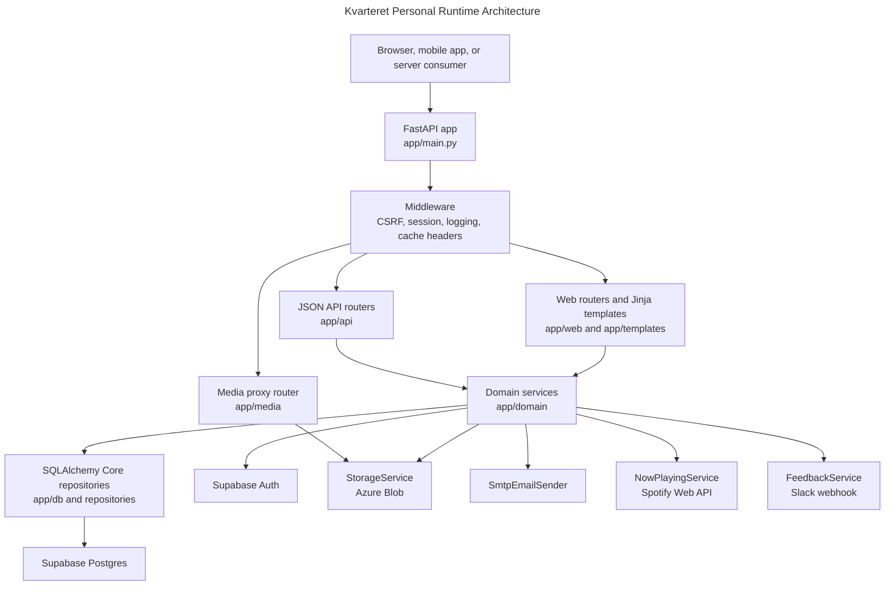

# Kvarteret Personal Architecture

`kvarteret-personal` is a FastAPI application that serves four surfaces from one runtime:

- a server-rendered admin UI using Jinja templates and Tailwind CSS
- JSON APIs under `/api/*`
- signed media proxy routes for private photos
- system routes such as `/health`

The app factory is `app/main.py:create_app`. It builds middleware for method override, CSRF validation for web mutations, session hydration, request logging, and HTML cache headers. Route groups are then mounted from `app/system/router.py`, `app/media/router.py`, `app/api/router.py`, and `app/web/router.py`.

`app/runtime.py` builds the application container. The container wires settings, database sessions, authentication, storage, email, domain services, and third-party adapters into one object graph that tests and scripts can replace.

## Route Surfaces

The public JSON API routes are composed in `app/api/router.py`.

`/api/v1/mobile-card/*` is the current mobile-card API. It issues email access codes, creates signed sessions, returns the current card profile, renews sessions through `X-Mobile-Card-Session-Token`, and accepts mobile logout diagnostics.

`/api/DigitalInternkort/*` is the deprecated compatibility surface for older Internkort clients. It adapts old Norwegian/camel-case request and response shapes onto the same mobile-card service layer.

`/api/v1/volunteer-prospects` accepts public recruitment leads from `samfunnetibergen`.

`/api/now-playing` exposes the shared Spotify now-playing state with permissive CORS and no-store headers for app and site consumers.

The web admin routes are composed in `app/web/router.py`. They cover login, volunteers, groups, courses, admin accounts, volunteer applications, feedback, and Spotify connection management.

The media routes in `app/media/router.py` keep private files behind backend-signed URLs instead of exposing provider storage URLs directly.

## Data Model Ownership

Supabase Postgres is the primary database. This repository owns schema migrations through Alembic under `migrations/`. The old event tables (`public.events`, `public.event_types`, `public.event_organizer_groups`, `public.event_organizer_group_memberships`, and `public.rooms`) are retired and removed by migration.

The old migration plan remains useful as history, but it is no longer the primary documentation for how the system works today. Current architecture facts should live here or in reference docs.

## Deployment Shape

Vercel loads `api/index.py`, which imports `create_app()` and exposes a module-level ASGI `app`. Static assets are prepared for Vercel by `scripts/prepare_vercel_static.py`, which copies `app/static/` into `public/static/`.

Local development runs the app as a Uvicorn factory through `make run`, which uses `app.main:create_app`.

## Security Shape

The admin UI uses signed session cookies. Supabase Auth is used for auth-user lifecycle and password operations, while the app stores its own web session rows in Supabase Postgres.

The mobile app uses signed bearer tokens issued by `MobileCardService`, not Supabase user sessions. Mobile-card tokens identify a verified volunteer profile for a bounded lifetime.

Web mutations require CSRF validation when a session cookie is present. JSON API routes do not use the web CSRF middleware; they rely on route-specific auth and validation.
