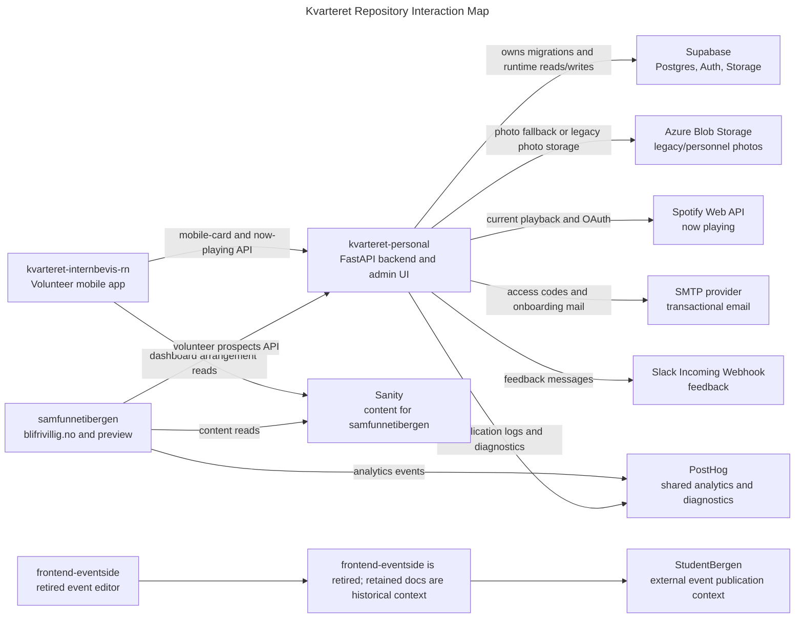

# Kvarteret System Map

This page explains how the Kvarteret repositories in scope relate to each other. It focuses on current production and preview boundaries, not old migration history.

`kvarteret-personal` is the central backend for personnel data, mobile-card data, and volunteer prospect intake. It stores most application state in Supabase Postgres and exposes a checked-in OpenAPI contract for generated clients.

`kvarteret-internbevis-rn` is the Expo React Native app used by volunteers. It depends on `kvarteret-personal` for mobile-card login/profile data and the now-playing endpoint. Its current dashboard event reads are Sanity-backed; any generated personal event operations are stale.

`samfunnetibergen` is the Next.js site for recruitment and public event display. The production site is `blifrivillig.no`, released from the `main` branch through a manual release. The next/preview site is `neste.samfunnetibergen`, deployed from the `develop` branch in the Vercel Preview environment. It reads public arrangement content from Sanity and calls `kvarteret-personal` server-side for volunteer prospect submissions.

`frontend-eventside` was the internal event editor at `event.kvarteret.no`. The repo is retired; its stale direct Supabase event-table queries are historical only and no longer form a live boundary for `kvarteret-personal`.

## Data Direction

The old event boundary is retired. Current public arrangement display in `samfunnetibergen` and the mobile dashboard reads from Sanity. `kvarteret-personal` no longer exposes event API routes in `openapi.json`, and `frontend-eventside` is not a live consumer.

The volunteer recruitment boundary is cleaner. `samfunnetibergen` validates the public form and proxies submissions to `kvarteret-personal`, which creates the registration records and sends any follow-up email through its configured email adapter.

The mobile-card boundary is owned by `kvarteret-personal`. The React Native app stores a signed session token and presents it as a bearer token for profile reads.

## Release Boundaries

`kvarteret-personal` owns its OpenAPI artifact. Consumers regenerate clients from `openapi.json`; they are not supposed to copy handwritten API shapes.

`samfunnetibergen` has two visible tracks: `main` to `blifrivillig.no` by manual release, and `develop` to `neste.samfunnetibergen` through Vercel Preview.

`kvarteret-internbevis-rn` ships through Expo/EAS and app-store release processes. Backend changes must be additive unless the supported app versions have already been updated.
