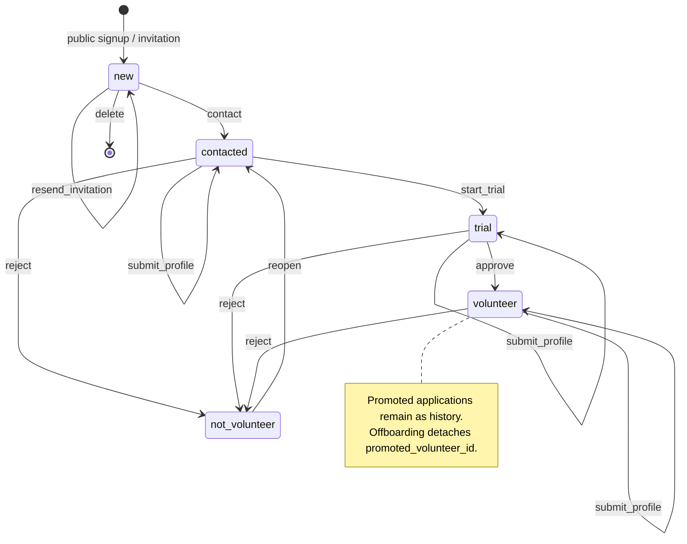
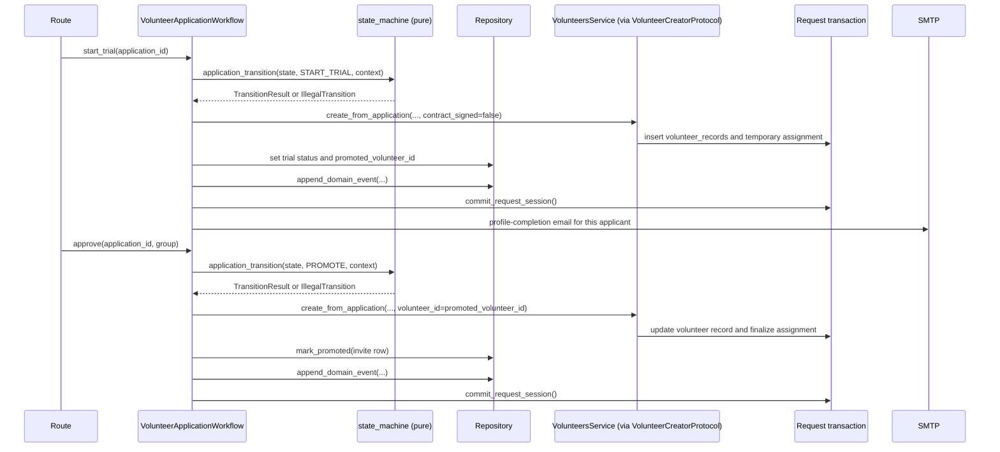

# The Volunteer Application Lifecycle

The volunteer application rules live in the pure state machine in
`app/domain/volunteer_applications/state_machine.py`. Public prospects, direct
invites, and friend invitees use the same lifecycle. A friend invitation adds
relationship metadata and an informational “start together” note; it does not
change the legal transitions for either application.

## States and Transitions

An application's `status` column holds one of five states, constrained by a
database CHECK:

Profile submission keeps the current lifecycle state. Trial-shift marking is
legal in the active recruitment states and never changes the application
state; it flips a flag and emits an audit event.

## Public Choices and Promotion

The public form submits a required first choice and an optional second choice.
Personal stores immutable display labels for both choices as application
metadata. A public choice does not always correspond one-to-one with an
operational group: several bar-area choices route to roles under the
Skjenkegruppen parent group.

Only the first choice determines the suggested operational group and role.
Promotion therefore offers the primary placement, not the secondary choice.

## Guards

`approve` requires a submission row — there is nothing to promote without
applicant details. Friend-invited applications do not participate in a shared
approval guard: each application's own state and submission determine whether
it can be approved.

## How a Transition Executes

The workflow coordinator gives every lifecycle action the same shape, and the
unit of work makes the database part atomic by construction:

Each applicant's promotion happens in that applicant's request transaction. A
friend who has not submitted cannot block the inviter, and vice versa. Emails
go out only after commit, and every transition appends a `domain_events` row in
the same transaction as the state change. State in columns remains the source
of truth; the log is an audit, not an event-sourcing store (ADR-003).

## Cross-Module Boundary

Trial start provisions the volunteer record and temporary assignment, and
approval reuses that record to finalize the assignment. Both writes go through
`VolunteersService.create_from_application`, reached via
`VolunteerCreatorProtocol` injected in `app/runtime.py`. There is no static
service import between the modules; the owning module performs its own write.
