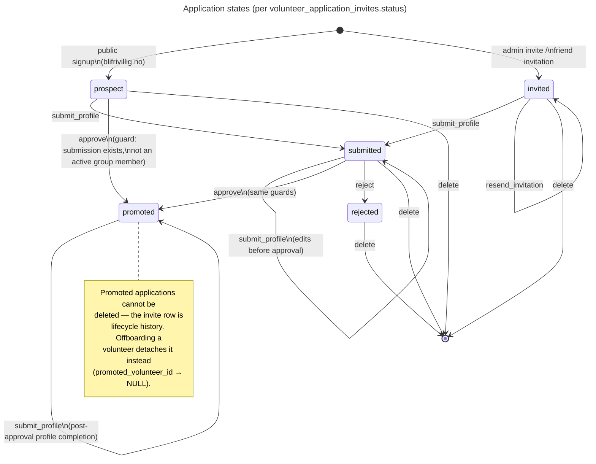
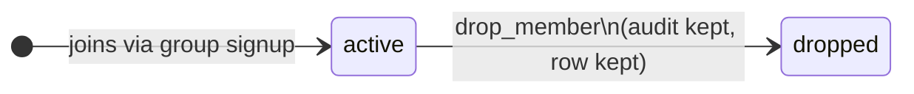
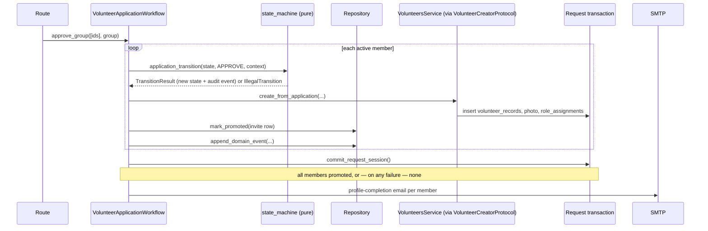

# The Volunteer Application Lifecycle

The volunteer application is the most important business process in this system, so its rules live in exactly one place: the pure state machine in `app/domain/volunteer_applications/state_machine.py`. Everything else — routes, services, the workflow coordinator — asks the machine whether a move is legal and records what it did. This page explains the lifecycle as shipped; ADR-001 fixes the architectural style and ADR-003 the audit design.

## States and Transitions

An application's `status` column holds one of five states, constrained by a database CHECK. The transition table was verified against production data and the live routes before it was frozen — notably, the public-signup flow really does approve `prospect`-status applications after a trial shift, and the post-approval profile-completion email reuses the same `/apply/{token}` link, so `submit_profile` is legal from `promoted`.

Trial-shift marking (`mark_trial_shift`) is legal in `prospect`, `invited`, and `submitted` and never changes the state — it flips a flag and emits an audit event.

Group members additionally carry a membership state:

## Guards

Two rules depend on more than the current state, so they live in the machine's `TransitionContext` and are covered by the exhaustive test matrix:

- **`approve` requires a submission row** — there is nothing to promote without applicant details.
- **Per-person `approve` is illegal for an active group member with other active members.** The group is approved together or not at all; the admin UI hides the per-person button and the workflow rejects direct route access. Group approval passes `is_part_of_active_group=False` because it *is* the group-level action.

## How a Transition Executes

The workflow coordinator (`workflow.py`) gives every lifecycle action the same shape — and the unit of work makes the database part atomic by construction:

Three properties fall out of this shape:

1. **Atomic group approval.** Every member's promotion, including the cross-module volunteer creation, happens in the one request transaction. The e2e suite proves it by injecting a failure on the second member and asserting nobody was promoted, no audit row survived, and no email was sent.
2. **Commit-before-effect.** Emails go out only after `commit_request_session()`; an email never announces a state the database can still roll back.
3. **A complete audit trail.** Every transition (and creation) appends a row to `domain_events` — event type, actor, subject, payload, timestamp — in the same transaction as the state change. State in columns remains the source of truth; the log is an audit, not an event-sourcing store (ADR-003).

## The Greppable Invariant

Status literals (`'prospect'`, `'submitted'`, …) appear in exactly one file in `app/domain`: `state_machine.py`. Everything else uses `ApplicationState` / `MembershipState` enums. If a grep for those literals matches anywhere else in the domain layer, something has regressed.

## Cross-Module Boundary

Approval creates a volunteer — a write into the volunteers module's tables. That write goes through `VolunteersService.create_from_application`, reached via `VolunteerCreatorProtocol` injected in `app/runtime.py`. There is no static import between the modules, so the import-linter independence contract holds without exceptions; at runtime the owning module performs its own write.
