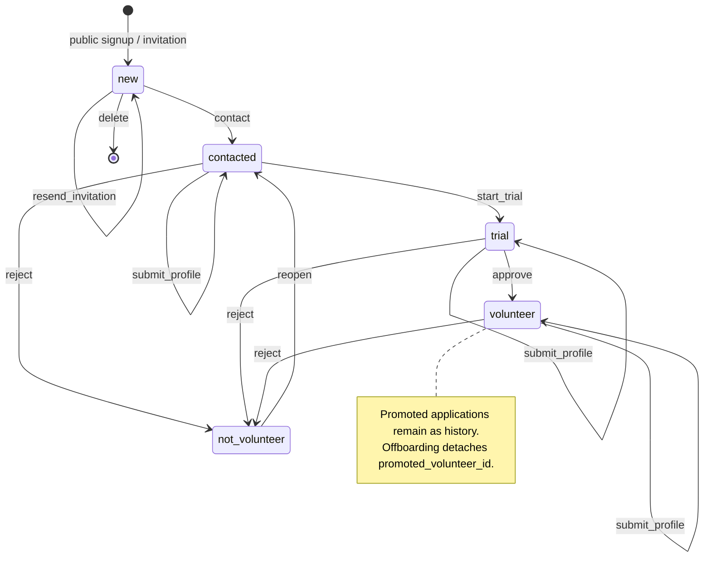
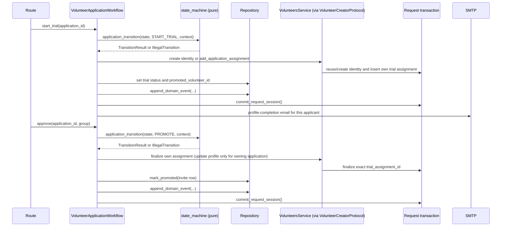

# The Volunteer Application Lifecycle

The volunteer application rules live in the pure state machine in
`app/domain/volunteer_applications/state_machine.py`. Public prospects, direct
invites, and friend invitees use the same lifecycle. A friend invitation adds
relationship metadata and an informational “start together” note; it does not
change the legal transitions for either application.

## States and Transitions

An application's `status` column holds one of five states, constrained by a
database CHECK:

```mermaid
stateDiagram-v2
    [*] --> new: public signup / invitation
    new --> new: submit_profile
    contacted --> contacted: submit_profile
    trial --> trial: submit_profile
    volunteer --> volunteer: submit_profile
    new --> new: resend_invitation
    new --> contacted: contact
    contacted --> trial: start_trial
    trial --> volunteer: approve
    contacted --> not_volunteer: reject
    trial --> not_volunteer: reject
    volunteer --> not_volunteer: reject
    not_volunteer --> contacted: reopen
    new --> [*]: delete
    note right of volunteer
        Promoted applications remain as history.
        Offboarding detaches promoted_volunteer_id.
    end note
```

Profile submission keeps the current lifecycle state. Trial-shift marking is
legal in the active recruitment states and never changes the application
state; it flips a flag and emits an audit event.

## Public Choices and Promotion

The public API retains `first_choice_group_slug` and optional
`second_choice_group_slug` for compatibility. For new requests each selection
creates an independent application, rather than ranking a fallback choice.
Every application has its own token, display label, lifecycle, trial dates,
assignment and notification. Legacy two-choice rows remain unchanged.

A recruitment target is a group plus an optional suggested role. Several
bar-area choices route to different roles in Skjenkegruppen. Matching an email
to an active application is scoped to that target, so applications to different
roles remain independent. A repeat submission reuses the active application
without changing its snapshot and sends a continuation link only to its email
address. Signing up for a target where the person already has a signed
assignment for the current semester gives an actionable conflict message.

Existing volunteers may apply to additional targets. Public registration does
not expose their canonical profile or return application tokens. At staff trial
start the service reuses an unambiguous existing volunteer identity, or creates
one if none exists. Per-email PostgreSQL transaction locks serialize duplicate
checks, identity creation and lifecycle writes.

`owns_volunteer_profile` records which application created the canonical
identity. Only that application maintains the canonical profile; additional
applications store separate snapshots. Trial start creates an assignment for
each application. Approval finalizes that exact assignment without changing
other memberships or overwriting an existing volunteer's profile/photo.
Rejecting a trial removes only its unsigned assignment; it never deletes the
person or another application's assignment. Approval or rejection of A does
not transition B.

The response preserves `registrationId` for old callers and adds
`registrationIds` for the whole batch. Batch IDs are persisted with idempotency
claims so retries return the same result without duplicate emails. Different
request hashes may reference the same active application.

## Guards

`approve` requires a trial application and a complete submitted profile. Friend-invited applications do not participate in a shared
approval guard: each application's own state and submission determine whether
it can be approved.

## How a Transition Executes

The workflow coordinator gives every lifecycle action the same shape, and the
unit of work makes the database part atomic by construction:

```mermaid
sequenceDiagram
    participant R as Route
    participant W as VolunteerApplicationWorkflow
    participant SM as state_machine (pure)
    participant Repo as Repository
    participant V as VolunteersService (via VolunteerCreatorProtocol)
    participant DB as Request transaction
    participant SMTP as SMTP

    R->>W: start_trial(application_id)
    W->>SM: application_transition(state, START_TRIAL, context)
    SM-->>W: TransitionResult or IllegalTransition
    W->>V: create identity or add_application_assignment
    V->>DB: reuse/create identity and insert own trial assignment
    W->>Repo: set trial status and promoted_volunteer_id
    W->>Repo: append_domain_event(...)
    W->>DB: commit_request_session()
    W->>SMTP: profile-completion email for this applicant

    R->>W: approve(application_id, group)
    W->>SM: application_transition(state, PROMOTE, context)
    SM-->>W: TransitionResult or IllegalTransition
    W->>V: finalize own assignment (update profile only for owning application)
    V->>DB: finalize exact trial_assignment_id
    W->>Repo: mark_promoted(invite row)
    W->>Repo: append_domain_event(...)
    W->>DB: commit_request_session()
```

Each applicant's promotion happens in that applicant's request transaction. A
friend who has not submitted cannot block the inviter, and vice versa. Emails
go out only after commit, and every transition appends a `domain_events` row in
the same transaction as the state change. State in columns remains the source
of truth; the log is an audit, not an event-sourcing store (ADR-003).

## Cross-Module Boundary

Trial start creates or reuses the volunteer record and provisions a separate
temporary assignment. Approval finalizes that assignment through
`VolunteersService.create_from_application` for the owning application or
`add_application_assignment` for an existing identity, reached through
`VolunteerCreatorProtocol` injected in `app/runtime.py`. The applications
module never imports the volunteers service directly.

Mobile-card login prefers an eligible permanent volunteer over a new trial.
One pending or rejected additional application cannot disable permanent access.
Prospects with multiple trials receive a temporary card for a deterministically
selected unexpired trial; access-code redemption resolves the issuing application
rather than whichever trial is newest. Existing trial sessions still exchange
for permanent sessions after their own application is approved.

This describes the current checkout, not a verified production rollout.
Apply migrations through `20261001_1300` and deploy Personal before the website.
The migration keeps legacy applications and marks one original profile owner
per linked identity. Its downgrade refuses to restore the old unique
registration/request-hash constraint if new continuation claims make that
impossible; it does not delete those records.

Source: `app/domain/volunteer_applications/{service,repository,workflow,models}.py`,
`app/domain/volunteers/{service,repository}.py`,
`app/domain/mobile_card/{service,repository}.py`, and
`app/api/v1/volunteer_prospects.py`. The website proxy and form in the sibling
`samfunnetibergen/apps/web/src` actively consume this contract.
